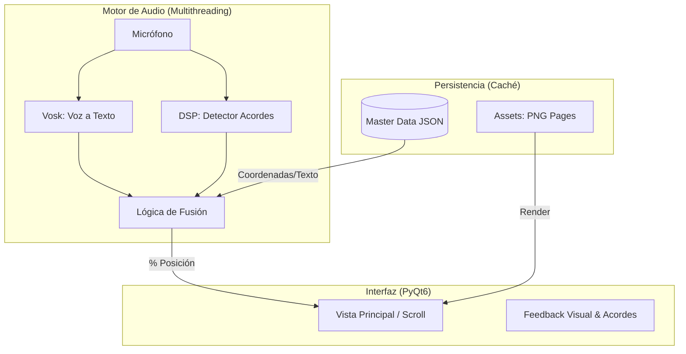

# Especificación de Requisitos de Software (SRS)

**Nombre del Proyecto:** ResucitóLive 
**Versión:** 0.1  
**Fecha:** 11/02/2026  
**Autor:** Andrés Marín Pérez  
**Estado:** Borrador Inicial  

---

## 1. Introducción

### 1.1 Propósito
El propósito de este documento es definir los requisitos funcionales y no funcionales para el desarrollo de una aplicación de escritorio destinada a músicos del Camino Neocatecumenal. La aplicación facilitará el aprendizaje y la ejecución de cantos litúrgicos mediante el procesamiento del PDF oficial "Resucitó" y el seguimiento en tiempo real (*score following*) de la voz y la guitarra del usuario.

### 1.2 Alcance
El sistema abarcará:
* Ingesta y visualización fiel del PDF "Resucitó".
* Extracción de datos semánticos (letra vs. acordes) del archivo.
* Motor de audio híbrido (Voz + Armonía) para detectar la posición en el canto.
* Interfaz gráfica de usuario (GUI) con desplazamiento automático (*scrolling*) y visualización de acordes.
* Funcionamiento 100% desconectado (Offline).

---

## 2. Descripción General

### 2.1 Perspectiva del Producto
El software actúa como una capa de "Realidad Aumentada Musical" sobre un documento estático. A diferencia de lectores de PDF tradicionales, este sistema "entiende" la música contenida en la página y reacciona a la interpretación del usuario.

El sistema implementa una **estrategia de procesado único**. Durante el primer inicio, el sistema realizará una 'ingesta pesada' (extracción de imágenes y mapeo de coordenadas). Los resultados se almacenarán en una caché local estructurada. En inicios subsecuentes, el tiempo de carga se reducirá de ~30 segundos (procesamiento completo) a <1 segundo (lectura de caché).

### 2.2 Características de los Usuarios
* **Perfil:** Salmistas y cantores de comunidades neocatecumenales, así como gente que quiera aprender a tocar la guitarra.
* **Habilidades Técnicas:** Variables. La interfaz debe ser extremadamente simple.
* **Equipamiento:** Ordenador portátil (Windows/Mac/Linux), micrófono integrado o externo, guitarra española (con uso frecuente de cejilla/capo).

---

## 3. Requisitos Funcionales (RF)

### 3.1 Módulo A: Ingesta y Procesamiento (Backend PDF)

| ID         | Requisito                                  | Descripción                                                  | Prioridad |
| :--------- | :----------------------------------------- | :----------------------------------------------------------- | :-------- |
| **RF-A00** | **Check de Integridad (Hashing)**          | El sistema calculará un hash MD5/SHA del PDF. Si el hash coincide con el registro en el archivo `config.json` de la caché, se saltará el procesamiento. | Alta      |
| **RF-A01** | **Carga de Archivo**                       | Al iniciar el sistema se cargará el archivo `RESUCITO XX EDICION 2014.pdf`. | Alta      |
| **RF-A02** | **Renderizado de Imagen**                  | Conversión de páginas PDF a imágenes de alta resolución (PNG/JPG) para su uso como fondo en la GUI (vía `pdf2image`). | Alta      |
| **RF-A03** | **Mapeo de Coordenadas**                   | Extracción de texto y sus coordenadas (`x`, `y`, `width`, `height`) usando `pdfplumber`. | Alta      |
| **RF-A04** | **Clasificación Semántica**                | Algoritmo basado en Regex para distinguir si un token de texto es **Letra** (ej: "Señor") o **Acorde** (ej: "Re-", "Fa7", "Sol#"). | Alta      |
| **RF-A05** | **Normalización de Acordes**               | Conversión interna de notación latina (PDF) a notación anglosajona (Sistema). *Ejemplo:* `Re-` → `Dm`; `Sol7` → `G7`. | Media     |
| **RF-A06** | **Estructura de Almacenamiento**           | Las páginas se guardarán como imágenes individuales en una carpeta `assets/pages/`. Los datos de texto y acordes se guardarán en un único `master_data.json`. | Alta      |
| **RF-A07** | **Carga Diferida (Lazy Loading)**          | El sistema solo cargará en RAM la imagen de la página actual y la siguiente para optimizar el uso de memoria (RNF-03). | Media     |
| **RF-A08** | **Algoritmo de Agrupamiento (Clustering)** | El sistema agrupa automáticamente los tokens de texto por su coordenada `Y`. Si un acorde está a menos de `N` píxeles de una frase, se vinculan como un único "Evento Musical". | Alta      |
| **RF-A09** | **Detección de Flujo Estándar**            | El sistema asume un orden de lectura de arriba a abajo y de izquierda a derecha, ignorando números de página o notas al pie (vía Regex). | Alta      |

### 3.2 Módulo B: Motor de Audio Híbrido (Core)

| ID         | Requisito                        | Descripción                                                  | Prioridad |
| :--------- | :------------------------------- | :----------------------------------------------------------- | :-------- |
| **RF-B01** | **Captura de Audio**             | Acceso al micrófono del sistema con gestión de *buffers* de baja latencia. | Alta      |
| **RF-B02** | **Reconocimiento de Voz (Vosk)** | Transcripción *offline* de voz a texto y *Fuzzy Matching* (coincidencia aproximada) con la letra extraída del PDF. Ventana de búsqueda: +/- 5 palabras. | Alta      |
| **RF-B03** | **Detección Armónica (Chroma)**  | Cálculo de FFT/Chromagrama en tiempo real para identificar el acorde dominante que está sonando. | Alta      |
| **RF-B04** | **Gestión de Cejilla (Capo)**    | Selector en la UI para indicar el traste de la cejilla (0-9). El sistema debe transponer matemáticamente el acorde esperado antes de compararlo con el audio detectado. | Alta      |
| **RF-B05** | **Fusión de Sensores**           | Lógica de decisión ponderada: - Si `Confianza_Voz` > 60% → Mover cursor. - Si `Confianza_Voz` < 60% Y `Confianza_Guitarra` > 80% → Mover cursor. - En caso contrario → Esperar. | Alta      |
| **RF-B06** | **Seguimiento Adaptativo**       | El scroll no es constante; el sistema "salta" o se desliza hacia la siguiente coordenada `y` solo cuando se valida el par (Palabra + Acorde). | Alta      |

### 3.3 Módulo C: Interfaz de Usuario (Frontend Yousician-style)

| ID         | Requisito                     | Descripción                                                  | Prioridad |
| :--------- | :---------------------------- | :----------------------------------------------------------- | :-------- |
| **RF-C01** | **Vista de Scroll Vertical**  | Las líneas del PDF se recortan y se presentan en una lista continua que se desplaza hacia arriba automáticamente. | Alta      |
| **RF-C02** | **Línea de Actuación**        | Zona fija horizontal (hilo de ejecución) donde el usuario debe leer. El contenido fluye hacia esta línea. | Alta      |
| **RF-C03** | **Panel de Acordes Dinámico** | Panel lateral que muestra la imagen del diagrama de guitarra del *próximo* acorde 2 segundos antes de que llegue a la línea de actuación. | Media     |
| **RF-C04** | **Feedback Visual**           | Resaltado de la palabra/acorde actual: - **Verde:** Coincidencia detectada. - **Neutro:** Esperando input. | Baja      |
| **RF-C05** | **Navegación Manual**         | Posibilidad de hacer clic en cualquier parte del texto para forzar al sistema a saltar a ese punto (recuperación de errores). | Alta      |

---

## 4. Requisitos No Funcionales (RNF)

* **RNF-01 Latencia:** El tiempo de respuesta sistema-usuario (desde que se canta hasta que se mueve el cursor) debe ser inferior a **200ms**.
* **RNF-02 Offline First:** La aplicación no debe requerir conexión a internet para ninguna funcionalidad principal (ni carga de PDF, ni reconocimiento de voz).
* **RNF-03 Rendimiento:** El uso de CPU en un procesador Intel i5 de 8ª gen (o equivalente) no debe superar el **30%**.
* **RNF-04 Portabilidad:** El código debe ser compatible con Windows 10/11, macOS y Linux.

---

## 5. Stack Tecnológico

* **Lenguaje:** Python 3.10+
* **Interfaz Gráfica (GUI):** PyQt6 (Qt for Python).
* **Procesamiento de PDF:** `pdfplumber` (texto/datos), `pdf2image` (renderizado).
* **Reconocimiento de Voz:** Vosk API (Modelo `vosk-model-small-es`).
* **Procesamiento de Audio (DSP):** `NumPy`, `SciPy` (FFT rápida) o `Librosa` (análisis armónico).
* **Entrada de Audio:** `SoundDevice` o `PyAudio`.

---

## 6. Diagrama de Arquitectura (Mermaid)

ResucitóLive/
├── main.py                 # Punto de entrada de la aplicación
├── Resucito_2014.pdf       # Archivo fuente (necesario solo 1ª vez)
├── cache/                  # Persistencia para carga instantánea
│   ├── metadata.json       # Hash del PDF y configuración del usuario
│   ├── master_data.json    # Base de datos de texto, acordes y coordenadas Y
│   ├── canciones.json      # Índice de búsqueda (Título -> Página)
│   └── assets/
│       └── pages/          # Renderizado PNG (p001.png... p250.png)
└── models/
    └── vosk-model-es/      # Modelo de lenguaje offline
